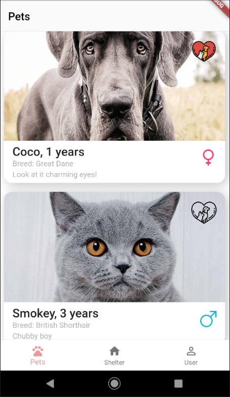
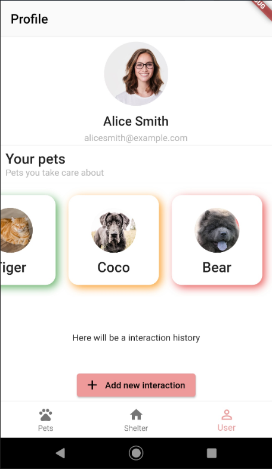

# PetCare

Flutter application is designed to save the planet through the rescue of homeless animals - take wards and track visits, or take it home.

## About

Every day I see flocks of stray dogs and cats that need help. There are no places for new pets in the shelters, and there is not enough funding to provide all the necessary pets. The idea of my app is to help shelters talk about themselves, introduce their wards and find volunteer help. Users can choose a pet and take care of it, and later, maybe, take it home. 

- [Video on youtube](https://www.youtube.com/watch?v=qKnwXX9md0o)

## Screenshots

